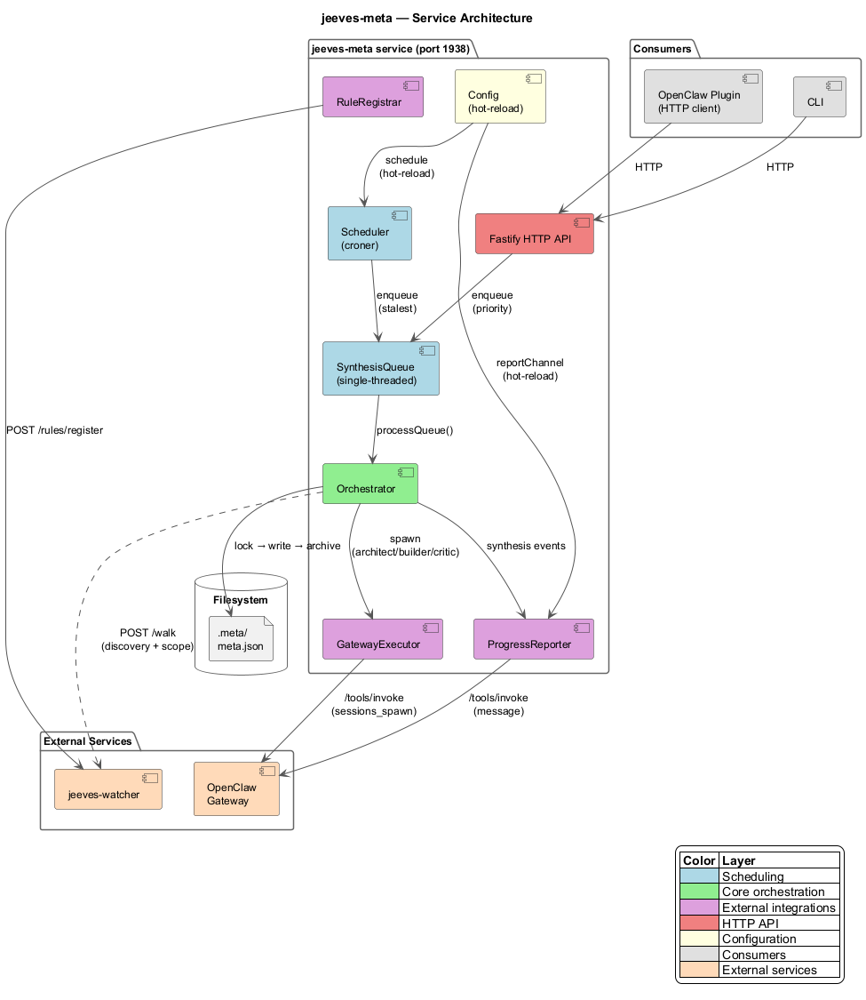
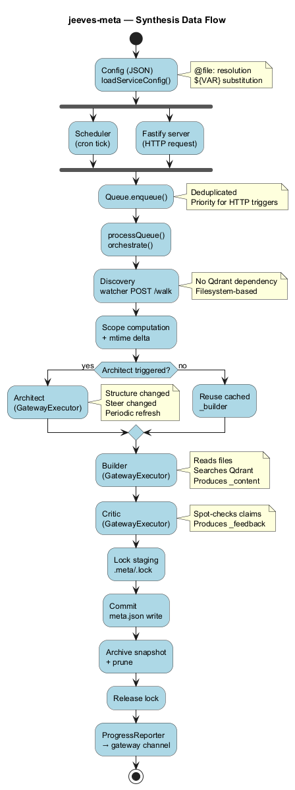

# jeeves-meta

Knowledge synthesis engine for the Jeeves platform. Transforms raw data archives into concise, queryable meta-analyses through a three-step LLM pipeline: **Architect** → **Builder** → **Critic**.

## Overview

jeeves-meta is an HTTP service that discovers `.meta/` directories via the jeeves-watcher filesystem walk endpoint (`POST /walk`), builds an ownership tree, and schedules synthesis cycles based on weighted staleness. Each cycle:

1. **Architect** — analyzes data shape and crafts a task brief with search strategies
2. **Builder** — executes the brief, queries the semantic index, and produces a synthesis
3. **Critic** — spot-checks claims, evaluates against steering prompts, and provides feedback

Results are written to `.meta/meta.json` files with full archive history, enabling self-improving feedback loops.

## Packages

| Package | Description |
|---------|-------------|
| [`@karmaniverous/jeeves-meta`](packages/service/README.md) | HTTP service — Fastify API, built-in scheduler, synthesis queue, CLI |
| [`@karmaniverous/jeeves-meta-openclaw`](packages/openclaw/README.md) | OpenClaw plugin — thin HTTP client, interactive tools, TOOLS.md injection |

## Architecture



- **jeeves-meta service** runs as a standalone HTTP service (NSSM/systemd/launchd)
- **Built-in scheduler** (croner-based) discovers stale candidates and enqueues them
- **GatewayExecutor** spawns LLM sessions via the OpenClaw gateway `/tools/invoke` endpoint
- **jeeves-watcher** provides filesystem enumeration (`POST /walk`) and hosts virtual inference rules
- **OpenClaw plugin** is a thin HTTP client — all logic lives in the service

## Synthesis Data Flow



## Quick Start

### Install and start the service

```bash
npm install -g @karmaniverous/jeeves-meta

# Print NSSM/systemd/launchd install instructions
jeeves-meta service install --config /path/to/jeeves-meta.config.json

# Or start directly
jeeves-meta start --config /path/to/jeeves-meta.config.json
```

### CLI commands

```bash
jeeves-meta status                    # service health + queue state
jeeves-meta list                      # list all metas with summary
jeeves-meta detail <path>             # full detail for a single meta
jeeves-meta preview                   # dry-run next synthesis
jeeves-meta synthesize                # enqueue synthesis
jeeves-meta seed <path>               # create .meta/ for a new path
jeeves-meta unlock <path>             # remove stale .lock file
jeeves-meta config                    # query active config (supports JSONPath)
jeeves-meta service start|stop|status|install|remove
```

### As an OpenClaw plugin

Install the plugin package. Seven tools become available to the agent:

- `meta_list` — list metas with summary stats and filtering
- `meta_detail` — full detail for a single meta with optional archive history
- `meta_trigger` — manually trigger synthesis (enqueues work)
- `meta_preview` — dry-run showing what inputs would be gathered
- `meta_seed` — create `.meta/` directory for a new path
- `meta_unlock` — remove stale `.lock` from a meta entity
- `meta_config` — query service configuration with optional JSONPath

## Configuration

```json
{
  "watcherUrl": "http://localhost:1936",
  "gatewayUrl": "http://127.0.0.1:18789",
  "gatewayApiKey": "your-api-key",
  "defaultArchitect": "@file:prompts/architect.md",
  "defaultCritic": "@file:prompts/critic.md",
  "port": 1938,
  "schedule": "*/30 * * * *",
  "reportChannel": "C0AK9D0GL5A",
  "metaProperty": { "_meta": "current" },
  "metaArchiveProperty": { "_meta": "archive" },
  "logging": { "level": "info" }
}
```

See the [Configuration Guide](packages/service/guides/configuration.md) for all fields and defaults.

## Development

```bash
npm install
npm run build       # build both packages
npm run lint        # lint both packages
npm run typecheck   # typecheck both packages
npm test            # run all tests
npm run knip        # detect unused exports/deps
npm run docs        # generate TypeDoc documentation
```

## Documentation

- **[Service Guides](packages/service/guides/index.md)** — concepts, configuration, orchestration, scheduling, architecture
- **[CLI Reference](packages/service/guides/cli.md)** — all CLI commands with usage
- **[Plugin Guides](packages/openclaw/guides/index.md)** — setup, tools reference, virtual rules, TOOLS.md injection

## License

BSD-3-Clause

---

Built for you with ❤️ on Bali by [Jason Williscroft](https://github.com/karmaniverous) & [Jeeves](https://github.com/jgs-jeeves).
