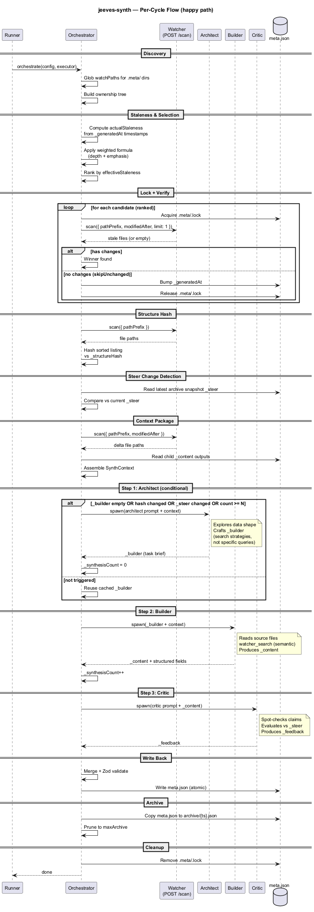

# Orchestration

## The 13-Step Per-Cycle Flow

Each synthesis cycle follows these steps:

1. **Discover** — glob `watchPaths` for `.meta/` directories
2. **Build tree** — construct the ownership tree with parent/child relationships
3. **Compute staleness** — calculate `actualStaleness` from `_generatedAt`
4. **Weight staleness** — apply depth + emphasis formula for `effectiveStaleness`
5. **Rank candidates** — sort by `effectiveStaleness` descending
6. **Lock** — acquire `.meta/.lock` (skip if locked, proceed if stale lock)
7. **Verify changes** — `watcher.scan()` with `modifiedAfter` to check for real changes
8. **Structure hash** — detect scope-level file additions/removals
9. **Steer change** — compare current `_steer` against latest archive snapshot
10. **Context package** — assemble `SynthContext` (delta files, child outputs, previous content)
11. **Execute pipeline** — architect (conditional) → builder → critic
12. **Merge & write** — validate with Zod, write `meta.json` atomically
13. **Archive & cleanup** — snapshot to archive, prune old entries, release lock

## Error Handling

The "never write worse" principle:

| Failure | Behavior |
|---------|----------|
| Architect fails, existing `_builder` | Use cached `_builder`, proceed |
| Architect fails, no `_builder` (first run) | Cycle fails, retry next cycle |
| Builder fails | Don't update `meta.json` |
| Critic fails | Write `_content` without `_feedback` |
| Subprocess timeout | Kill process, treat as step failure |
| Zod validation fails | Treat as step failure, don't write |

## Scope File Condensation

Large scopes (500+ files) are condensed into glob-like summaries: `src/**/*.ts (142 files)`. Delta files (changed since last cycle) are always listed individually.

## Batch Mode

Set `batchSize > 1` to synthesize multiple metas per invocation. The orchestrator loops through ranked candidates, returning an `OrchestrateResult[]`.
