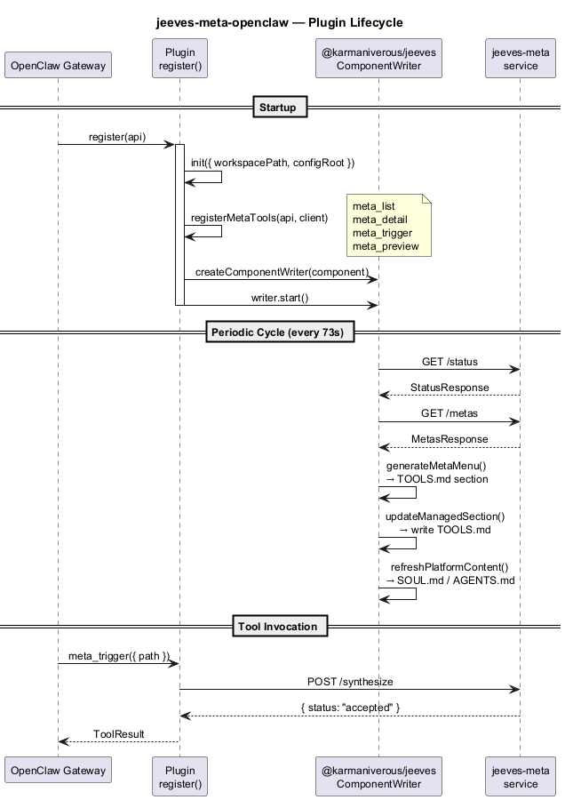

# @karmaniverous/jeeves-meta-openclaw

OpenClaw plugin for [jeeves-meta](../service/). A thin HTTP client that registers interactive tools and uses [`@karmaniverous/jeeves`](https://github.com/karmaniverous/jeeves) core for managed TOOLS.md content writing and platform maintenance.

## Features

- **Seven interactive tools** — `meta_list`, `meta_detail`, `meta_trigger`, `meta_preview`, `meta_seed`, `meta_unlock`, `meta_config`
- **MetaServiceClient** — typed HTTP client delegating all operations to the running service
- **TOOLS.md injection** — periodic refresh of entity stats via `ComponentWriter` from `@karmaniverous/jeeves` (73-second prime interval)
- **Dependency health** — shows warnings when watcher/gateway are degraded
- **Consumer skill** — `SKILL.md` for agent integration

## Plugin Lifecycle



## Install

```bash
npm install @karmaniverous/jeeves-meta-openclaw
```

Then run the CLI installer to register with the OpenClaw gateway:

```bash
npx @karmaniverous/jeeves-meta-openclaw install
```

## Configuration

The plugin resolves settings via a three-step fallback chain: plugin config → environment variable → default.

| Setting | Plugin Config Key | Env Var | Default |
|---------|-------------------|---------|---------|
| Service URL | `serviceUrl` | `JEEVES_META_URL` | `http://127.0.0.1:1938` |
| Config Root | `configRoot` | `JEEVES_CONFIG_ROOT` | `j:/config` |

```json
{
  "plugins": {
    "entries": {
      "jeeves-meta-openclaw": {
        "enabled": true,
        "config": {
          "serviceUrl": "http://127.0.0.1:1938",
          "configRoot": "j:/config"
        }
      }
    }
  }
}
```

The `configRoot` setting tells `@karmaniverous/jeeves` core where to find the platform config directory. Core derives `{configRoot}/jeeves-meta/` for component-specific configuration.

## Documentation

- **[Plugin Setup](guides/plugin-setup.md)** — installation, config, lifecycle
- **[Tools Reference](guides/tools-reference.md)** — meta_list, meta_detail, meta_trigger, meta_preview, meta_seed, meta_unlock, meta_config
- **[Virtual Rules](guides/virtual-rules.md)** — watcher inference rules
- **[TOOLS.md Injection](guides/tools-injection.md)** — dynamic prompt generation

## License

BSD-3-Clause
