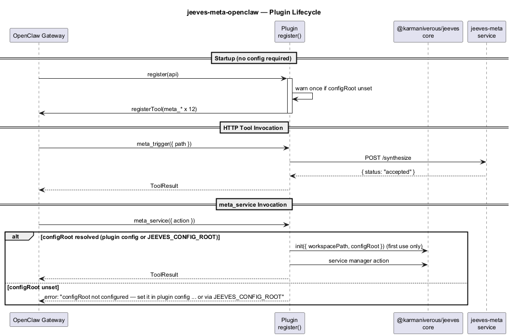

# @karmaniverous/jeeves-meta-openclaw

OpenClaw plugin for [jeeves-meta](../service/). A standard OpenClaw plugin and thin HTTP client that registers interactive tools on top of the [`@karmaniverous/jeeves`](https://github.com/karmaniverous/jeeves) core SDK. It writes no workspace files: static platform content is rendered by `jeeves install`, and live state is served by the tools.

## Features

- **Twelve tools** — standard: `meta_status`, `meta_config`, `meta_config_apply`, `meta_service`; custom: `meta_list`, `meta_detail`, `meta_trigger`, `meta_preview`, `meta_seed`, `meta_unlock`, `meta_queue` (list/clear/abort), `meta_update`
- **MetaServiceClient** — typed HTTP client delegating all operations to the running service
- **Phase-state awareness** — tools expose per-meta `_phaseState`, `owedPhase`, and phase-state summary from the service's phase-state machine
- **Lazy config** — registers with no config; `configRoot` is resolved when a tool needs it
- **Consumer skill** — `jeeves-meta` skill shipped through the plugin manifest

## Plugin Lifecycle



## Install

Install with the Jeeves CLI, which runs the OpenClaw install and writes the plugin config:

```bash
jeeves install meta --config-root j:/config
```

Or install it as a standard OpenClaw plugin and configure it yourself:

```bash
openclaw plugins install npm:@karmaniverous/jeeves-meta-openclaw@<version> --pin --accept-capabilities
```

Restart the gateway afterwards. There is no plugin-specific installer (the `npx @karmaniverous/jeeves-meta-openclaw install` CLI was removed in favour of `jeeves install`).

## Configuration

The plugin resolves settings via a fallback chain: plugin config → environment variable → default.

| Setting | Plugin Config Key | Env Var | Default |
| --- | --- | --- | --- |
| Service URL | `apiUrl` | `JEEVES_META_URL` | `http://127.0.0.1:1938` |
| Config Root | `configRoot` | `JEEVES_CONFIG_ROOT` | _none_ |

```json
{
  "plugins": {
    "entries": {
      "jeeves-meta-openclaw": {
        "enabled": true,
        "config": {
          "apiUrl": "http://127.0.0.1:1938",
          "configRoot": "j:/config"
        }
      }
    }
  }
}
```

The `configRoot` setting tells `@karmaniverous/jeeves` core where to find the platform config directory. Core derives `{configRoot}/jeeves-meta/` for component-specific configuration. It has no default: `jeeves install --config-root <path>` writes it.

`configRoot` is resolved **lazily**. Registration always succeeds without it (with a running gateway, `openclaw plugins install` activates the plugin before `jeeves install` writes its config), logging one warning:

```text
[jeeves-meta] configRoot not configured yet — meta_service will be unavailable until it is set in plugin config or JEEVES_CONFIG_ROOT
```

Only `meta_service` needs it (it resolves the service config path); invoked without it, the tool returns an error naming both ways to set it. Core `init()` runs the first time `configRoot` resolves. Every other tool only talks HTTP to the service and works without it.

## Documentation

- **[Plugin Setup](guides/plugin-setup.md)** — installation, config, lifecycle
- **[Tools Reference](guides/tools-reference.md)** — 12 tools: standard (meta_status, meta_config, meta_config_apply, meta_service) + custom (meta_list, meta_detail, meta_trigger, meta_preview, meta_seed, meta_unlock, meta_queue, meta_update)
- **[Virtual Rules](guides/virtual-rules.md)** — watcher inference rules

## License

BSD-3-Clause
