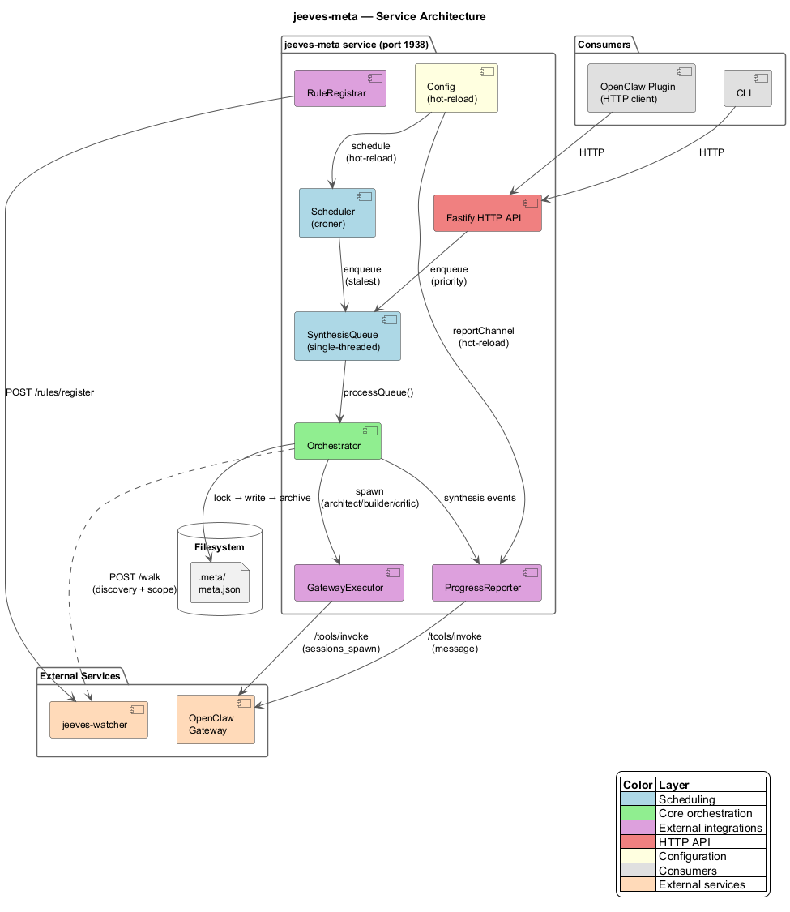
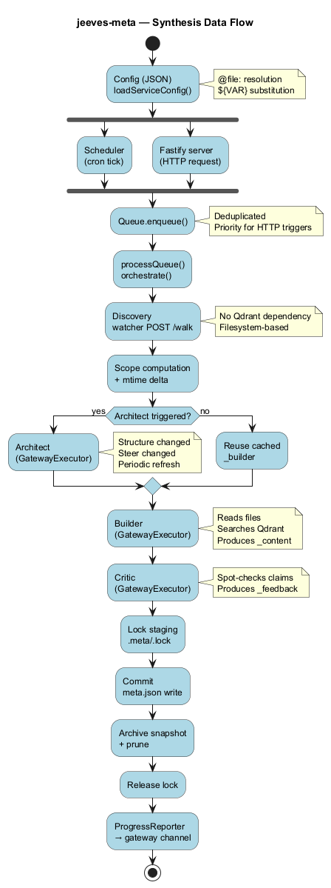

# Architecture

## Components

| Component | Responsibility |
|-----------|---------------|
| `Scheduler` | Croner-based cron, discovers stalest candidate, enqueues work |
| `SynthesisQueue` | Three-layer queue (current + overrides + automatic) with deduplication |
| `GatewayExecutor` | Spawns LLM sessions via gateway `/tools/invoke`, polls for completion |
| `ProgressReporter` | Sends synthesis events to a channel via gateway `/tools/invoke` → `message` tool |
| `RuleRegistrar` | Registers 2 virtual inference rules with watcher at startup |
| `HttpWatcherClient` | Watcher HTTP client with 3-retry exponential backoff and connection timeout protection |
| Fastify server | 13 HTTP endpoints across 10 route modules |
| Config hot-reload | `fs.watchFile` monitors config; hot-reloadable fields applied immediately, restart-required fields warn on change |
| Shutdown handlers | SIGTERM/SIGINT → stop scheduler → release lock → close server |

## Service Architecture

## Data Flow

## Discovery

The `discoverMetas()` function enumerates all `.meta/meta.json` files via the watcher's `POST /walk` endpoint (no Qdrant dependency). Paths are deduplicated by `.meta/` directory.

The `buildOwnershipTree()` function constructs the parent/child hierarchy:

1. Sort all meta paths by owner path length (shallowest first)
2. For each node, find the closest ancestor meta (longest owner path match)
3. Set `treeDepth = parentDepth + 1`; record bidirectional parent/child pointers

A lightweight variant, `buildMinimalNode()`, creates a shallow tree (self + direct children only) for targeted synthesis — avoiding full-tree cost when a specific path is requested.

### Scope Filtering

A meta **owns** its parent directory and all descendants, except subtrees that contain their own `.meta/`. Child `.meta/meta.json` files ARE included as rollup inputs.

`getDeltaFiles()` filters scope files locally by mtime since `_generatedAt`. On first run (no `_generatedAt`), all scope files are returned.

## Auto-Seed

The `autoSeedPass()` function is executed at the start of each scheduler tick (before discovery). It processes configured `autoSeed` rules:

1. For each rule, walk the watcher with the rule's `match` glob
2. Extract candidate directories (with optional `parentDepth` walking)
3. Build a map of owner path → effective options (**last match wins** for all fields including timeouts)
4. Filter out paths that already have a `.meta/` directory
5. Create `.meta/meta.json` for each new candidate with the matched rule's `steer`, `crossRefs`, and timeout overrides

## Virtual Rules

Two inference rules are registered with jeeves-watcher:

| Rule | Matches | Purpose |
|------|---------|---------|
| `meta-current` | `**/.meta/meta.json` | Index live synthesis with domain tags + extracted fields |
| `meta-archive` | `**/.meta/archive/*.json` | Index archived snapshots |

## Config Hot-Reload

The service monitors its config file via `fs.watchFile`. Fields are divided into two categories:

**Restart-required** (warn on change, no live effect): `port`, `watcherUrl`, `gatewayUrl`, `gatewayApiKey`, `defaultArchitect`, `defaultCritic`.

**Hot-reloadable** (applied immediately): `schedule` (cron reschedule), `logging.level` (Pino level change), and all remaining fields (`reportChannel`, `reportTarget`, `serverBaseUrl`, `watcherHealthIntervalMs`, `tier2ScanLimit`, `autoSeed`, `architectEvery`, `depthWeight`, `maxArchive`, `maxLines`, `thinking`, `skipUnchanged`, `metaProperty`, `metaArchiveProperty`).

## Phase-State Machine

The `src/phaseState/` module implements the per-meta phase-state machine:

| Module | Responsibility |
|--------|---------------|
| `derivePhaseState.ts` | Reconstruct `_phaseState` from legacy fields for backward compatibility |
| `invalidate.ts` | Detect structural/steer/cross-ref changes and mark phases as stale |
| `phaseTransitions.ts` | Pure functions for all state transitions (invalidation, success, failure, retry) |
| `phaseScheduler.ts` | Corpus-wide candidate selection: critic > builder > architect, staleness tiebreak |

## Two-Tier Scheduler

The `src/scheduler/` module provides the croner-based tick driver. The `src/scheduling/` module provides staleness computation:

| Module | Responsibility |
|--------|---------------|
| `scheduler/index.ts` | Croner cron, adaptive backoff, per-tick orchestration entry point |
| `scheduling/staleness.ts` | `getStalenessSeconds()` with `MAX_STALENESS_SECONDS` cap (365 days) |
| `scheduling/weightedFormula.ts` | `effectiveStaleness` formula: `actualStaleness × (normalizedDepth + 1) ^ (depthWeight × emphasis)` |

## Port Allocation

| Service | Port |
|---------|------|
| jeeves-server | 1934 |
| jeeves-watcher | 1936 |
| jeeves-runner | 1937 |
| **jeeves-meta** | **1938** |
